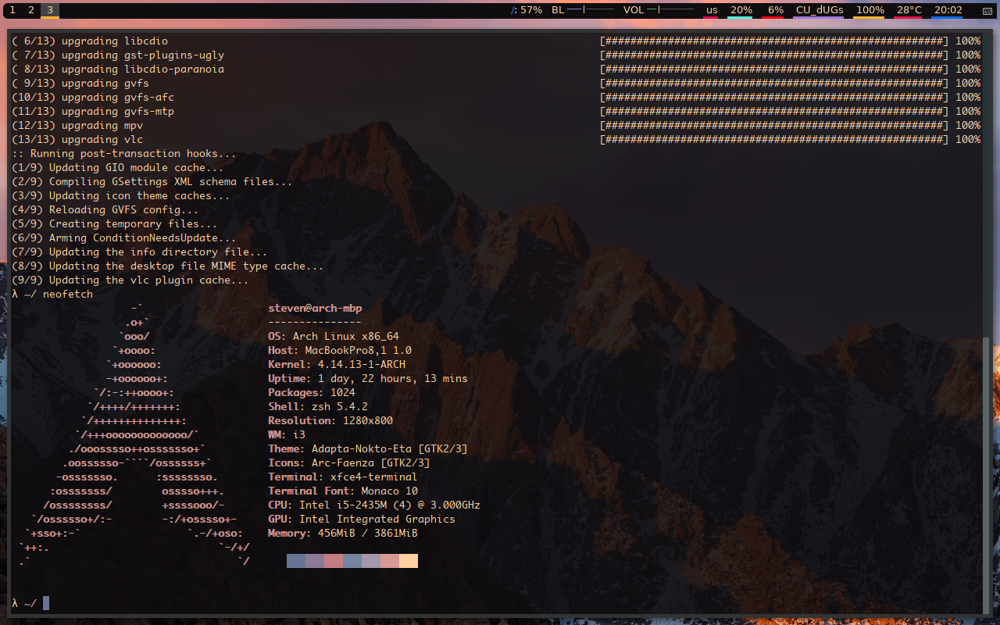
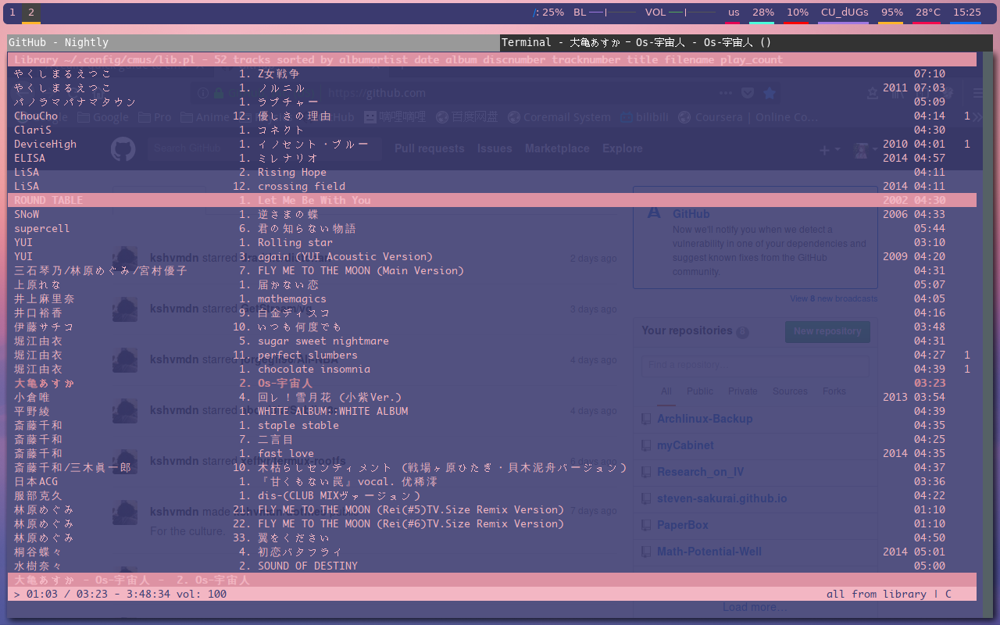

# Archlinux-Backup  
  
## Contents  
  
1. `archiso.txt` provides a link to my custom arch installation iso, which behaves exactly like the official one except that it provides wireless acess for macbook(or other laptops with broadcom network controller). It is created with `archiso` within arch(using kernel 4.12.8-1-ARCH), adding `dkms` and `broadcom-wl-dkms`.     

2. Includes example tests for Chinese latex(xelatex) and Qt & java environment.  

3. XX-Net config.    

4. configs for xfce4-terminal, xterm, vim, i3, conky, polybar

5. My arch installation record and useful scripts(ex. on startup).  

## Screenshot  

Currently running i3 with polybar, pywal ...

  

